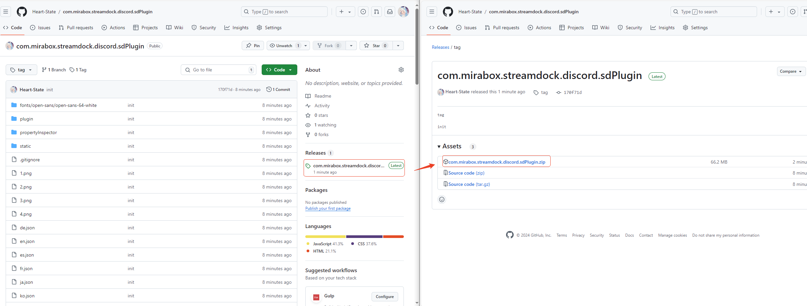
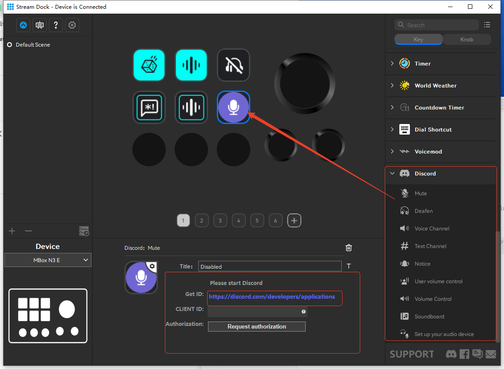

# How to use?

## 1. Install

Download the compressed file.

Unzip the downloaded compressed package to the plugins folder.

After unzipping to the plugin folder, restart the software and the discord plugin will be installed.

## 2. Get Client ID

Click this link to jump to the discord dev

Create an app and add a redirect address: http://127.0.0.1:3002

## 3. Authorization

After copying the ID, fill it into the discord plugin and click Request Authorization to authorize it before use.